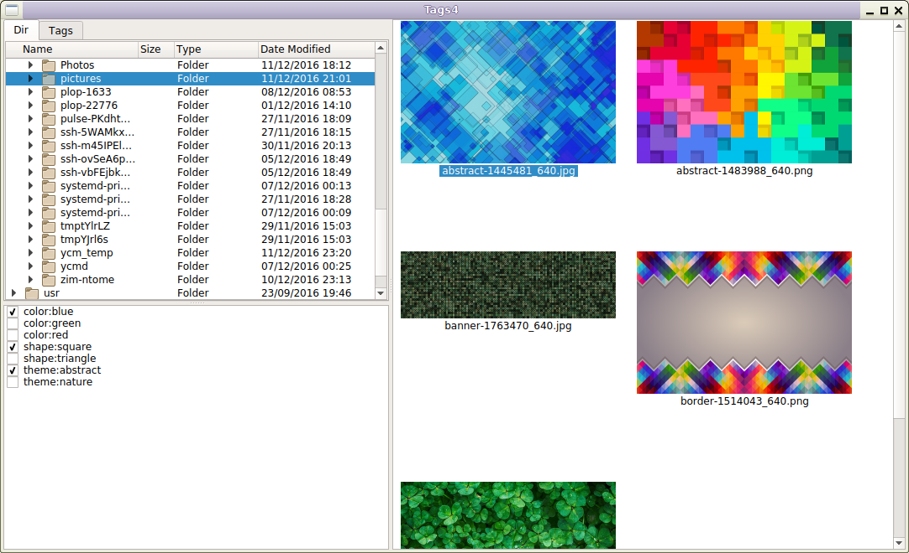
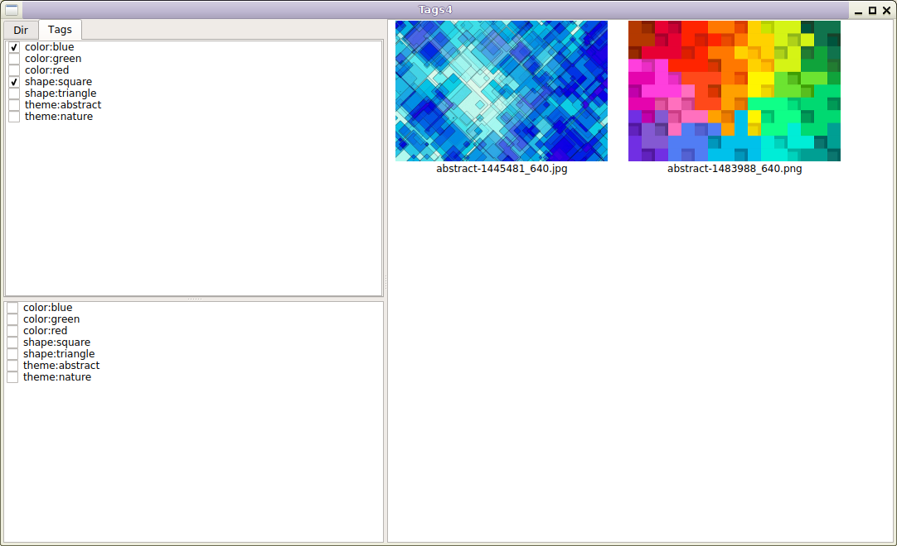

SIT-Tagger
----------

SIT-Tagger is an app for browsing tagged files.

For now, it consists in an image browser app, that allows to set custom text tags
on any image file, and then list image files matching checked tags.
The tags are saved in a local SQLite database.

Other apps reusing the same database will be added, and support for video files
will be added.

